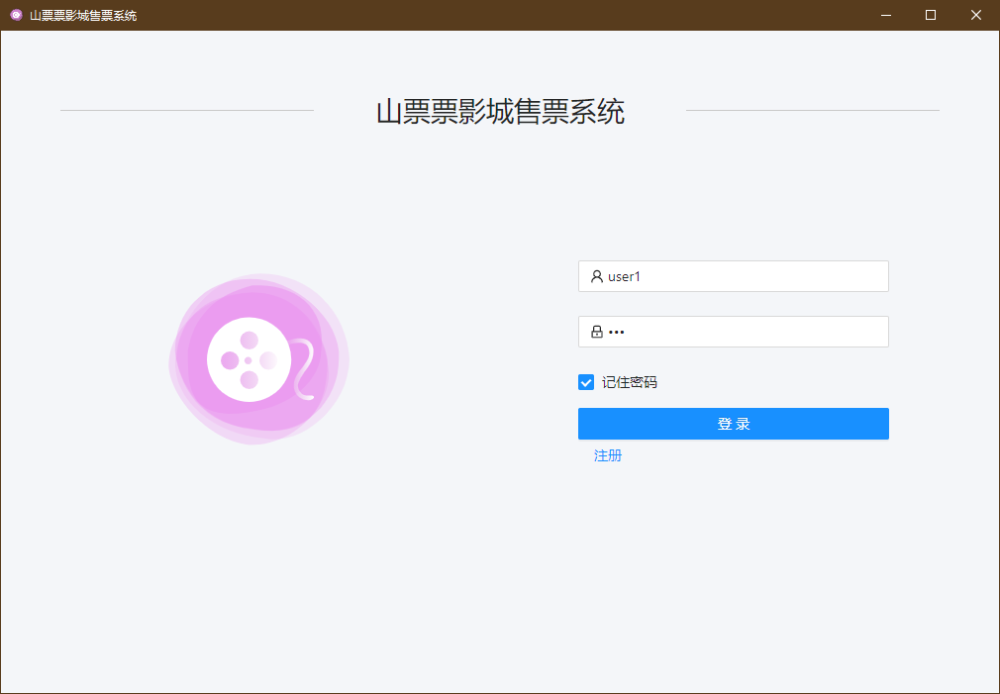
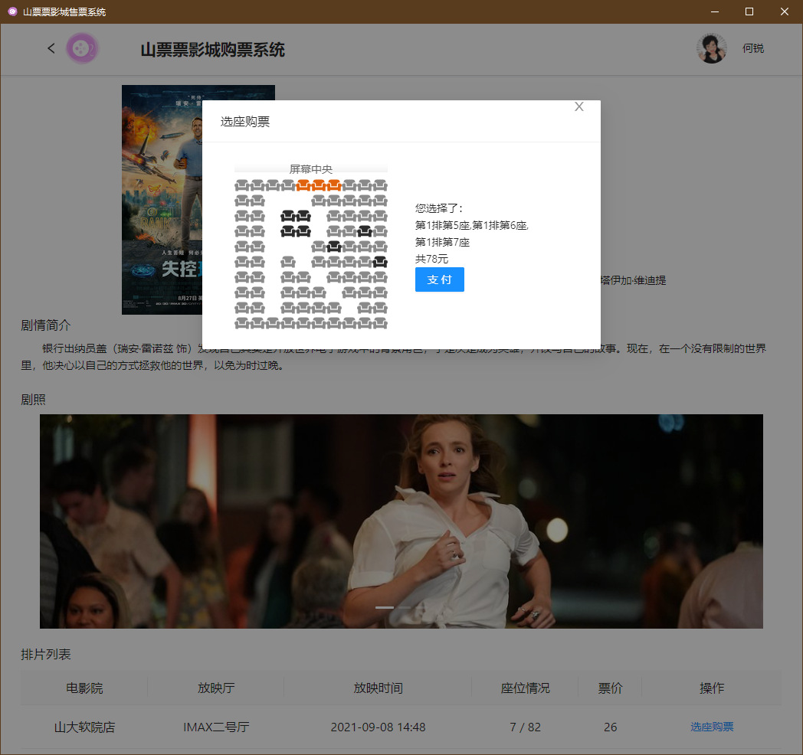
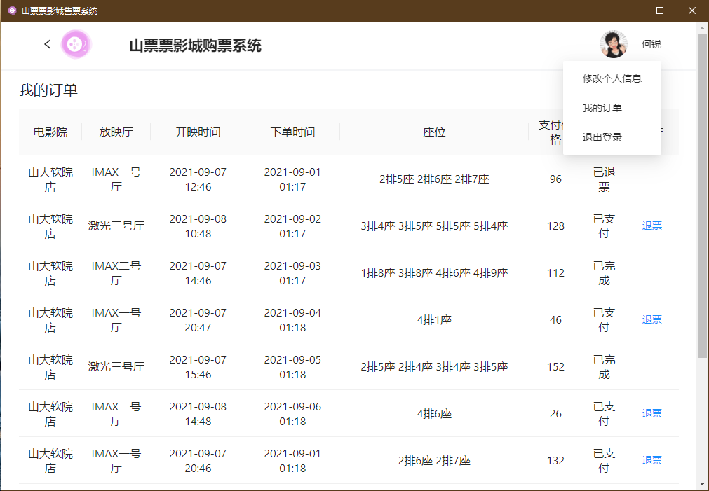
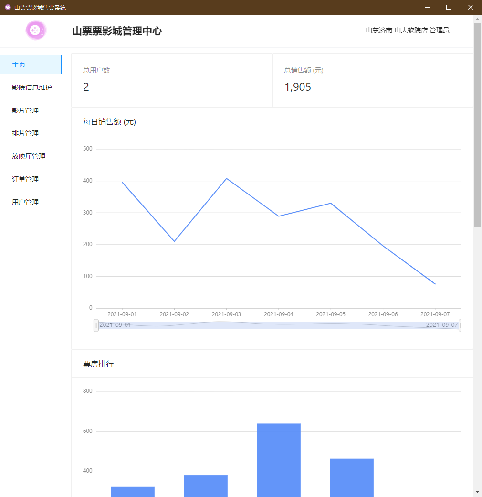
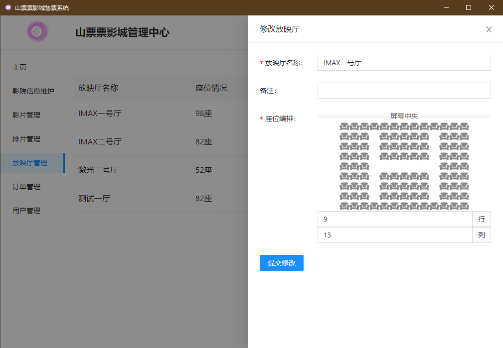
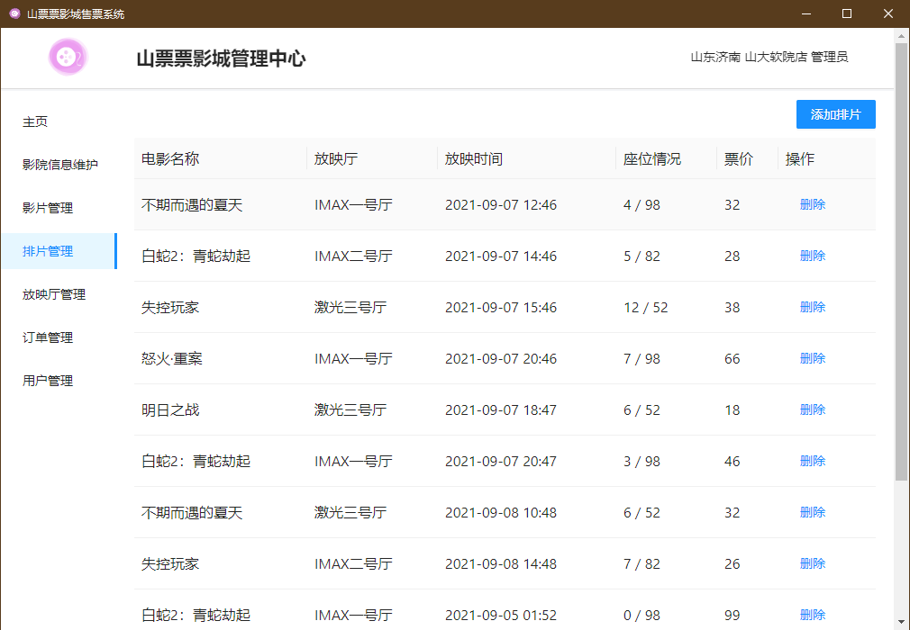

# 山东大学 2021 数据库系统课程设计 电影院售票系统

用户程序使用 Electron + React 实现，服务端使用 Koa2

- 安装依赖：`yarn`

- 调试模式运行：`yarn start`

- 生产模式打包： `yarn build`

- 生产模式打包为当前平台安装包： `yarn package`

应用程序接口地址在 src/main/rapper/customFetch.ts 中定义

默认为我本人服务器地址，可登录以下账号体验：

账号user1 密码123

账号admin1 密码123

## 功能清单：

- 注册登录

### 用户：

- 主页：查看排片（选择电影院分店、横幅、正在热映）、影片详情（简介、评分、影评、开放场次）

- 个人信息维护（昵称，头像，手机号，邮箱，生日，地区，密码

- 购票选座（选择对应的场次，图形化选座，购买）

- 查看订单（场次:电影院分店-放映厅-时间，座位[]，票价，取票码，状态:'已支付','已完成','已退票'）、退票

### 管理员：

- 主页：数据统计（总用户数、总销售量、日销售量、各影片票房排名柱状图、各影片票房占比饼图、各排片上座率柱状图）

- 影院信息维护（地区、影院分店名）

- 用户管理（添加删除用户、查看用户信息、用户权限

- 放映厅管理（座位编排、描述、座位数

- 影片管理（影片名、剧情介绍、剧组、剧照

- 排片管理（电影名、放映厅、时间、票价

- 订单管理（用户名、购买时间、电影名、场次、座位[]、票价、状态、退票

### 程序截图

